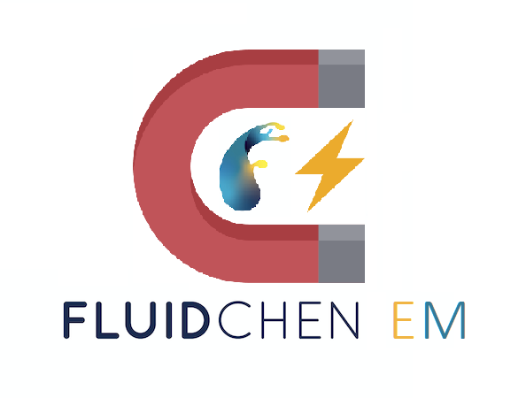

<div align="center">
  
</div>

Fluidchen is a CFD Solver developed for the CFD Lab taught at TUM Informatics, Chair of Scientific Computing in Computer Science.

## Software Requirements

This code is known to work on all currently supported Ubuntu LTS versions (22.04, 20.04, 18.04).
In particular, you will need:

- A recent version of the GCC compiler. Other compilers should also work, but you may need to tweak the CMakeLists.txt file (contributions welcome). GCC 7.4, 9.3, and 11.2 are known to work. See `CMakeLists.txt` and `src/Case.cpp` for some compiler-specific code.
- CMake, to configure the build.
- The VTK library, to generate result files. libvtk7 and libvtk9 are known to work.
- OpenMPI.
Get the dependencies on Ubuntu:

```shell
sudo apt-get update
sudo apt-get upgrade
sudo apt-get install build-essential cmake libvtk7-qt-dev openmpi-bin libopenmpi-dev
```

## Building the code

```shell
git clone https://gitlab.lrz.de/durganshu/group-i-cfd-lab.git
cd group-i-cfd-lab
mkdir build && cd build
cmake ..
make
```

After `make` completes successfully, you will get an executable `fluidchen` in your `build` directory. Run the code from this directory.

### Build options

By default, **fluidchen** is installed in `RELEASE` mode. In case you want to install in `DEBUG` mode, you can execute cmake as

```shell
cmake -DCMAKE_BUILD_TYPE=DEBUG ..
```

You can see and modify all CMake options with, e.g., `ccmake .` inside `build/` (Ubuntu package `cmake-curses-gui`).

## Running

In order to run **Fluidchen**, the case file should be given as input parameter. Some default case files are located in the `example_cases` directory. Navigate to the `build/` directory and run:

```shell
./fluidchen ../example_cases/LidDrivenCavity/LidDrivenCavity.dat
```

This will run the case file and create the output folder `../example_cases/LidDrivenCavity/LidDrivenCavity_Output`, which holds the `.vtk` files of the solution.

If the input file does not contain a geometry file, fluidchen will run the lid-driven cavity case with the given parameters.


